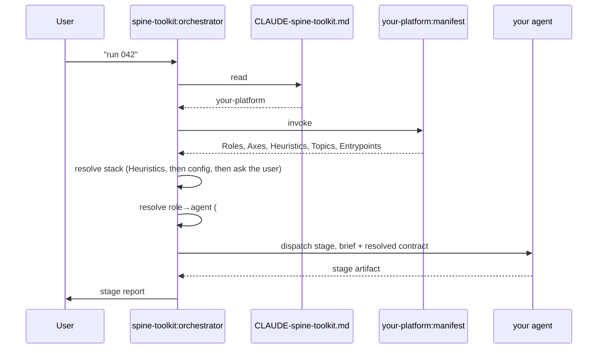

# Building a Platform Plugin

spine-toolkit runs the process — stages, artifacts, the rules for moving between them. It knows no
language and no framework. A **platform plugin** supplies the other half: who does the work, and
what they know.

This is the how-to: from an empty directory to a platform a real project can be configured against.
The normative reference for every table and every cell is
[`../conventions/platform-contract.md`](../conventions/platform-contract.md) — read this document for
the shape, that one for the letter. A complete working example that core's own test suite binds
against lives in [`../tests/fixtures/fixture-platform/`](../tests/fixtures/fixture-platform/), and
the first real platform is [`swift-platform`](https://github.com/iruirc/swift-platform).

---

## 1. The split

Two plugins. They share no code, no imports, and no filesystem paths. Everything core learns about
an ecosystem arrives by **invoking one skill**:

```
<your-plugin>/skills/manifest/SKILL.md   →   invoked as   <your-plugin>:manifest
```

That skill is data: five H2 tables and no procedure. Core never opens the host's plugin cache, never
reads your `plugin.json`, and never infers anything from the repository it is working in.

| Core owns | Your platform owns |
|---|---|
| Seven profiles and their stages | Which agent runs a stage |
| The artifacts (`Research.md`, `Plan.md`, `Validation.md`, `Review.md`, …) | How this ecosystem builds, tests and runs |
| The nine **role** names | The **agents** behind them |
| The `ecosystem` axis name | Every other stack axis and every value |
| Ten topic names its methodology skills ask for | The skills that answer them |
| The config file `CLAUDE-spine-toolkit.md` and its core blocks | The `## Stack` and `## Modules` blocks |

Core's stage briefs are written to stay tool-agnostic on purpose — "a build and a full test run are
mandatory", never the name of a build tool. `tests/foundation/lib/dispatch-vocabulary.test.bats`
fails the build if an ecosystem's vocabulary leaks into a workflow skill, a profile script, the
orchestrator, or an agent brief. That guard is what makes a second platform possible at all.

## 2. What a run looks like from your side



Nothing between "invoke" and "dispatch" is yours to implement. You declare; core resolves.

## 3. Build it

### Step 0 — prerequisites

`git`, `bash`, `python3` (core's `lint-manifest.sh` parses `plugin.json` with it), and
`bats-core` ≥ 1.10 if you want a test suite. Nothing else.

### Step 1 — copy the fixture

```bash
core=/path/to/your/checkout/of/core      # the repo holding workflows/ and skills/orchestrator/
cp -r "$core/tests/fixtures/fixture-platform" kotlin-platform
cd kotlin-platform
```

You now have `.claude-plugin/plugin.json`, `<plugin>/skills/manifest/SKILL.md`, and two stub agents. That is
a legal platform already — it just declares nothing real.

### Step 2 — `plugin.json`

```json
{
  "name": "kotlin-platform",
  "description": "Kotlin/JVM knowledge for spine-toolkit: …",
  "version": "0.1.0",
  "author": { "name": "…" },
  "repository": "https://github.com/…/kotlin-platform",
  "dependencies": ["spine-toolkit"]
}
```

`name` and `dependencies` are the two that matter. Without the dependency a user can install your
plugin alone, and every task then dies at the orchestrator's first step with no core to run it.

The name is also load-bearing inside the manifest: `lint-manifest.sh` rejects a `## Roles` row that
names an agent outside `<this plugin's name>:`, because that string travels into subagent dispatch
verbatim and a rename would leave it resolving to nothing.

### Step 3 — write the agents

One Markdown file per agent at `<plugin>/agents/<name>.md`, frontmatter `name` + `description` (plus whatever
your host supports — `model`, `color`, `tools`):

```markdown
---
name: kotlin-architect
description: |
  Designs and reviews Kotlin application architecture…
  Use when (en): "design architecture", "review project architecture"
  Use when (<lang>): the same triggers, one line per language you support
---

You are a Kotlin architect…

**First**: read `CLAUDE-spine-toolkit.md` in the project root.

## Invocation Context

You are dispatched by the spine-toolkit orchestrator during the Research / Plan / Analyze stage…
Write your output into the stage file the orchestrator names.
```

The frontmatter `description` is the one place in an agent file where a language other than English
belongs — triggers are bilingual regardless of the project's `## Language`, because a user types them
in whichever language they think in. The body stays English.

Three things every role agent needs:

1. **Read the project config first.** `CLAUDE-spine-toolkit.md` carries the resolved stack, the
   architecture, the conventions. An agent that skips it invents its own.
2. **Know it is being dispatched into a stage** and that its output becomes a named artifact
   (`Research.md`, `Plan.md`, `Validation.md`, `Review.md`, `Done.md`, `Walkthrough.md`).
3. **Bring the tooling.** Core's brief says "run a full test run"; only your agent knows this
   ecosystem's test runner, and only your validator can drive a running instance of the app.

Two artifacts have a machine-read first line — a contract shared between your agent, every
`workflow-*`, and the orchestrator. Get them wrong and the run stalls:

```
Validation.md   first line:  [VALIDATION_STATUS] = PASSED | FAILED | FLAKY
Review.md       first line:  [REVIEW_STATUS] = APPROVED | CHANGES_REQUESTED | DISCUSSION
```

### Step 4 — `## Roles`

All nine role names must appear. Map each to `plugin:agent`, or to an em dash for a role you do not
implement:

```
architect   = kotlin-platform:kotlin-architect
developer   = kotlin-platform:kotlin-developer
tester      = kotlin-platform:kotlin-tester
reviewer    = kotlin-platform:kotlin-reviewer
refactorer  = kotlin-platform:kotlin-refactorer
validator   = kotlin-platform:kotlin-validator
security    = —
diagnostics = kotlin-platform:kotlin-diagnostics
init        = kotlin-platform:kotlin-init
```

`—` is a **declared absence**, not a hole. Core dispatches around it: the stage runs in the main
context and announces the deviation in its first message. A row with an empty right-hand side is
neither, and the lint rejects it.

Where a role differs by stack, fan it out — one row per axis value, plus a bare fallback row:

```
developer[ui=Compose] = kotlin-platform:kotlin-compose-developer
developer[ui=Views]   = kotlin-platform:kotlin-views-developer
developer             = kotlin-platform:kotlin-developer
```

Rules the lint enforces, and the reasons they exist:

- The axis must be one core resolves — any `## Axes` axis except `ecosystem`, which is excluded from
  detection, so a row qualified on it matches nothing on any project, ever.
- The value must be one that axis lists.
- No two rows may share a left-hand side; every row after the first would be dead.
- A fanned-out role with no bare row falls through to the em dash on every project where that axis
  never resolved — the only symptom is a stage quietly announcing a deviation.

Write the rows so at most one axis-qualified row per role can match one resolved stack. Where two
could match, core takes the first in file order and your manifest is simply ambiguous.

### Step 5 — `## Axes`

The catalog of stack axes and their allowed values. It is the source of truth for two consumers:
`stack-detect`, and the option list the orchestrator shows the user when an axis cannot be read off
the repository.

```
ecosystem    = jvm
ui           = Compose, Views
async        = coroutines, RxJava
di           = Hilt, Koin, manual
architecture = MVVM, MVI, Clean Architecture
baseline     = API 26+, API 24+, JVM 17
tests        = JUnit5, Kotest
```

- **`ecosystem` is mandatory** and is the one axis whose meaning core fixes. Nothing in core reads
  its value today — a project names its platform outright in `## Platform` — but declare it: it is
  reserved for install-time discovery and for repositories holding two ecosystems.
- **Values are proper nouns and are never localized.** The option list is rendered in the user's
  language; an ordinary-word value like `manual`, translated into Russian, matches no catalog entry
  when the answer comes back.
- Everything else is yours. Core recommends but does not impose `ui`, `async`, `di`, `architecture`,
  `baseline`, `tests`.

Keep the catalog small. Every axis is a question the user may have to answer.

### Step 6 — `## Heuristics`

How axis values get read off a repository. Two kinds of row:

```
import: `androidx.compose` only (no android.view) → ui=Compose     # pins a value
token:  `suspend fun`                             → async=coroutines
path:   `ui/`, `*Screen.kt`                       → ui, architecture # flags axes as relevant
```

- A pinning row (`import:`, `token:`, `file:`) must name a value the axis lists under `## Axes` —
  that is what `stack-detect` returns.
- A signal whose value must be *computed* (a deployment target read out of a build file) pins
  nothing. Write it as a flagging `path:` row and let the config or the user supply the catalog
  value. `swift-platform` does exactly this for `baseline`, and says so in a note under the table.
- Write rows so a repository signal matches **exactly one** of them. Nothing in the contract states
  an evaluation order, and a reader who assumes one will be wrong half the time.
- Explicit non-detection is a legitimate row: `import: more than one of Compose/Views → ui
  unresolved (no detection)` is better than a rule that guesses.
- A `path:` row may carry a conditional add-on — `architecture (+ ui if a view binding is present)`.
  Write a condition the same scan can see; `stack-detect` corroborates it rather than trusting it.

### Step 7 — `## Topics`

Topic name → your skills that cover it, as comma-separated backtick-quoted **bare** names (no
`plugin:` prefix — a manifest is read one platform at a time):

```
state management → `arch-mvvm`, `arch-mvi`
navigation       → `nav-compose`
networking       → `net-ktor`
persistence      → `persistence-room`
dependency graph → `di-hilt`, `di-koin`
concurrency      → `concurrency-coroutines`
errors           → `error-architecture`
packaging        → `pkg-gradle-modules`
deep links       → `nav-deeplinks`
release ops      → `release-ops`
```

The vocabulary is open — you may add rows of your own, and core never reads them. But core's
methodology skills (`feature-requirements`, `feature-landscape`, `feature-estimation`,
`ops-checklist`) ask for exactly these ten names and **match them literally**. Copy them before
writing your platform, not after: a platform that spells `deep links` as `deeplinks` has no row for
the topic core asked for, and the skills behind it go unconsulted on every task, silently.

An em dash, or no row at all, means the same thing — you cover that topic with no skill of your own.
The consumer proceeds on its own knowledge and says so. Neither is an error.

`release ops` is the newest of the ten and the one most likely to be missing from an older
manifest: it holds everything core deliberately does not know about shipping — store review,
crash reporting, push delivery, permission prompts, OS-version fragmentation, binary distribution.

### Step 8 — `## Entrypoints`

Skills core invokes by name. One is defined today:

```
setup = `kotlin-setup`
```

`setup` is the platform half of installation. Core's `/setup` writes the config and every block that
is core's, then hands your skill `{lang, state, config_path, stack}`. You fill `## Stack` and
`## Modules` — the two blocks core cannot know — and return `{stack_lines, notes}`.

**Read the `stack` field.** It carries axis values core's caller already collected (your `init`
agent asks the stack questions before it scaffolds). Core forwards them unread, because only you can
tell a catalog value from the caller's private spelling of one. A setup skill that ignores it asks
every axis a second time — that is the bug the field exists to close.

`—`, or no row, is supported: core writes its blocks, leaves `## Stack` unset, and the orchestrator's
per-axis question fills it one task at a time.

Do **not** name that skill `setup`. It would collide with core's own in every natural-language
trigger — which is exactly why the binding goes through this table instead of a naming convention.
The same applies to every other core skill name: `orchestrator`, `stack-detect`, `lang`,
`agent-status`, `task-new`, `task-move`, `task-status`, `task-walkthrough`, `workflow-*`,
`feature-*`, `ops-checklist`.

### Step 9 — check it

```bash
"$core/scripts/lint-manifest.sh" /path/to/kotlin-platform
```

Point it at your **checkout**, not the installed copy. It checks: all five tables present; the Roles
rows cover the nine-role vocabulary and no more; every named agent has a file in your plugin and
lives in your namespace; no role mapped to nothing; every fan-out row keys on an axis core resolves
and a value `## Axes` lists; no two Roles rows share a left-hand side; a named `## Entrypoints` skill
exists.

It deliberately does **not** check `## Topics` — the reference fixture names placeholder skills on
purpose, so that check belongs to your own suite. Which brings us to:

### Step 10 — your own tests

Core's suite cannot reach into your tree, and yours must not reach into core's. What is worth
covering on your side:

- **Manifest structure** — run core's `lint-manifest.sh` against your plugin in CI.
- **Topics resolve** — every backtick-quoted skill name under `## Topics` exists as
  `<plugin>/skills/<name>/SKILL.md`. This is the check core cannot do for you, and the one that catches a
  renamed skill.
- **The ten topic names are spelled right** — grep for them literally.
- **Agents exist for every non-em-dash role** (the lint does this, but a local test fails faster).
- **Locale parity**, if you ship localized strings (Step 11).

`swift-platform` runs core's lint by cloning core in CI rather than vendoring it:

```yaml
- name: manifest contract, checked by core's own lint
  run: |
    git clone --depth 1 https://github.com/iruirc/spine-toolkit.git /tmp/upstream
    /tmp/upstream/scripts/lint-manifest.sh .
```

### Step 11 — internationalization (only if you ship user-facing strings)

English is the source of truth. A skill with user-facing strings puts them in
`<plugin>/skills/<name>/locales/en.md` with a key-for-key `ru.md` beside it, and references them from the
skill body by key — never inlined. The active language is `## Language` in the project config;
`/lang` switches it. Skill triggers stay bilingual regardless of the setting.

The convention is `conventions/i18n.md`, and the lints are `lint-i18n.sh` and `lint-locales.sh`.
A platform with no user-facing strings of its own — agents and topic skills only — needs none of
this.

### Step 12 — adapted forks, if you take core's lints

Core's lints are useful to a platform, and the plugins share no code. `swift-platform` takes them as
**adapted forks**: each records the core file it came from and that file's sha256 in its header.

```bash
# Adapted from spine-toolkit scripts/lint-manifest.sh sha256:6740aec3…
# Adapted from spine-toolkit's lint. Plugins share no code; update both or neither.
```

CI clones core and compares the recorded hash against the real one. When core's original moves, the
build goes red and a human decides whether the change belongs downstream. These are not copies to be
restored to match core — some differ in comments only, others differ in logic on purpose, which is
why equality is the wrong test.

### Step 13 — publish

```
/plugin marketplace add <you>/<your-marketplace>
/plugin install kotlin-platform
```

One caveat worth reading before you publish from your own marketplace. A marketplace declares
`allowCrossMarketplaceDependenciesOn`, and *only the root marketplace's allowlist applies — no
transitive trust*. So `"dependencies": ["spine-toolkit"]` pulls core in **only** where the user's
root marketplace allowlists the marketplace core is published from. Either ship both plugins from
one marketplace, or say in your README that `spine-toolkit` is installed first.

### Step 14 — try it end to end

```bash
cd /some/kotlin/project
# /setup            → asks which platform serves this project, writes CLAUDE-spine-toolkit.md
# /task-new         → creates Tasks/ACTIVE/001-…/Task.md
# /task-run 001     → the orchestrator resolves your manifest and dispatches your agents
# /agent-status     → which agents ran, what they cost
```

`/setup` with no platform plugin installed stops and says so. With exactly one it asks you to
confirm that one. The answer lands in `## Platform`, and that single line is the whole selection
mechanism from then on.

---

## 4. The nine roles, and where each is dispatched

Core dispatches by role; which agent that means is yours. This is where each one is actually used:

| Role | Dispatched at |
|---|---|
| `architect` | FEATURE Research (panel with `security`), Plan, Done · BUG Diagnose (panel with `diagnostics`), Plan · REFACTOR Analyze, Plan · TEST Analyze (panel with `tester`) · EPIC Research, Plan · RESEARCH Research (default) |
| `developer` | FEATURE Execute · BUG Fix |
| `tester` | FEATURE Execute and BUG Fix when `need_test` · REFACTOR Refactor, for a test-only phase · TEST Analyze (panel), Plan, Write |
| `reviewer` | Review, on every profile that has one, plus the whole REVIEW profile |
| `refactorer` | REFACTOR Refactor |
| `validator` | Validation, on FEATURE / BUG / REFACTOR / TEST |
| `security` | FEATURE Research (panel) · RESEARCH Research, when `research_agent=security` |
| `diagnostics` | BUG Reproduce, Diagnose (panel) · RESEARCH Research, when `research_agent=diagnostics` |
| `init` | Never dispatched by a workflow. Core's routing points the user at it for "create a project", and the platform usually also exposes it as its own command (`/swift-init`). |

A **panel** stage runs two agents on one stage; whether they go in parallel or in sequence is the
orchestrator's choice and needs no announcement.

Validation is where the ecosystem gap is widest, so core states the *policy* per profile and leaves
the *means* to your validator:

| Profile | Build | Full test run | Drive a running app |
|---|---|---|---|
| FEATURE | mandatory | mandatory | mandatory when there is a UI layer |
| BUG | mandatory | mandatory | mandatory — replay the reproduction |
| REFACTOR | optional | mandatory, as regression, tests unmodified | only if a UI layer was touched |
| TEST | — | mandatory, new tests green on first run | optional |

A platform with no way to drive a running instance declares that deviation in its validator; the
cases move to `ManualChecks.md` for a human, and the run continues with nothing claimed.

## 5. The smallest platform that is worth installing

Legal minimum: five tables, nine roles all set to `—`, `ecosystem` declared, no agents at all. Every
stage then runs in the main context and announces it. That passes the lint and teaches core nothing.

The smallest *useful* platform is roughly:

- `architect`, `developer`, `reviewer` mapped to real agents; the other six `—`;
- `ecosystem` plus one or two axes you can actually detect;
- the ten topic names present, most of them `—`;
- `setup = —`, letting the orchestrator ask per axis on the first task.

Grow it from there. Every `—` you replace is one more stage that gets an isolated context and an
independent look; every axis you add is one more question a user may have to answer.

## 6. Failure modes

These are the ones that fail *silently* — the lint cannot catch them, and nothing goes red:

| Symptom | Cause |
|---|---|
| A methodology skill never consults your skills for a topic | The topic name does not match one of the ten literally (`deeplinks` ≠ `deep links`). Core never fuzzy-matches. |
| An axis question's options never match the user's answer | A `## Axes` value that is an ordinary word got translated in the rendered option list. Use proper nouns. |
| A role silently degrades to the main context on every task | A fanned-out role with no bare fallback row, on a project where that axis never resolved. |
| A fan-out row never matches anything, anywhere | It keys on `ecosystem`, which is excluded from detection by construction. |
| The wrong agent runs a stage | Two fan-out rows can match the same resolved stack; core takes the first in file order. |
| Every task dies at the orchestrator's first step | `dependencies: ["spine-toolkit"]` missing, or the cross-marketplace allowlist did not cover it. |
| A stack question gets asked twice during install | Your `setup` skill ignores the forwarded `stack` field. |
| Dispatch resolves to nothing after a plugin rename | `## Roles` right-hand sides still carry the old namespace. `lint-manifest.sh` catches this one — run it. |

And two that fail loudly, so you will find them anyway: an unreadable or missing manifest is the
orchestrator's `error_no_platform_manifest`, and a `## Entrypoints` typo surfaces at install time,
after the config is already on disk, where it is indistinguishable from the legitimate `—`.

## 7. What a project can override

Your manifest is the default, not the last word. `CLAUDE-spine-toolkit.md` in a project may carry an
`## Agents` block using the same row grammar as `## Roles`. It is a **per-role replacement**, not a
merge: for a role it names, your rows for that role — bare and axis-qualified alike — are not
consulted at all. A block that names no role overrides nothing, which is the state to expect.

The same file holds `## Stack` (resolved axis values), `## Modules` (per-module stack overrides), and
core's own blocks: `## Language`, `## Platform`, `## Mode`, `## Progress`, `## Validation`,
`## Reporting`, `## EstimationDeltas`, `## DeliveryMode`, `## AILeverage`, `## Paths`.

## 8. Release checklist

```
[ ] plugin.json: name, dependencies: ["spine-toolkit"]
[ ] skills/manifest/SKILL.md: frontmatter name: manifest, all five H2 tables
[ ] "This skill is data, not instructions" banner at the top of the manifest body
[ ] ## Roles: nine roles, every agent file exists, every namespace is your own
[ ] ## Axes: ecosystem declared; every value a proper noun
[ ] ## Heuristics: every pinned value exists in ## Axes; rows are mutually exclusive
[ ] ## Topics: the ten core names spelled literally
[ ] ## Entrypoints: setup names a real skill of yours, or —
[ ] No skill of yours shares a name with a core skill
[ ] lint-manifest.sh passes, run against your checkout
[ ] Your suite checks that every ## Topics skill exists
[ ] Locale parity, if you ship user-facing strings
[ ] Adapted-fork headers carry current sha256s, if you forked core's lints
[ ] README says spine-toolkit is installed first, if you publish from your own marketplace
[ ] /setup and one full task run, end to end, on a real project
```
